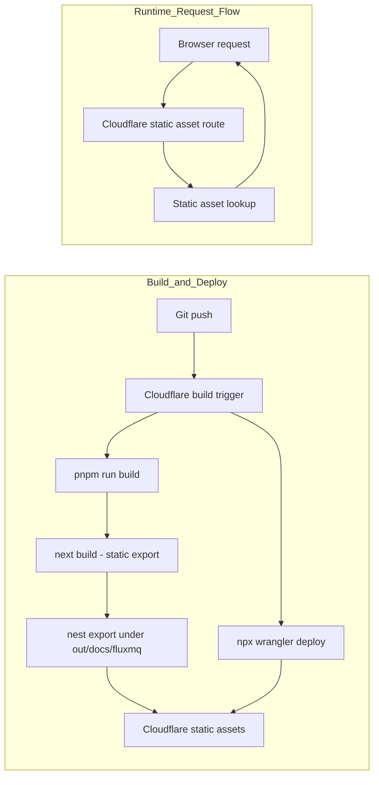

# FluxMQ Docs

Documentation site for [FluxMQ](https://github.com/absmach/fluxmq), built with [Fumadocs](https://fumadocs.dev) and Next.js.

The site is served under `/docs/fluxmq/`.

## Development

```bash
pnpm install
pnpm dev
```

Open http://localhost:3000/docs/fluxmq/ with your browser to see the result.

## Deployment

This site uses:

- **Next.js static export** — `next build` outputs static files to `out/`
- **Next.js `basePath`** — generates links and assets under `/docs/fluxmq`
- **Post-build nesting** — `scripts/nest-static-export.mjs` moves the export under `out/docs/fluxmq/` so Cloudflare static assets can serve it from the route prefix without custom Worker code

### Cloudflare build settings (Dashboard)

| Setting          | Value                         |
|------------------|-------------------------------|
| Build command    | `pnpm run build`              |
| Deploy command   | `npx wrangler deploy`         |
| Version command  | `npx wrangler versions upload` |
| Root directory   | `/docs`                       |

### Architecture



## Environment Variables

Only one build variable is needed:

```env
NEXT_PUBLIC_BASE_URL=https://www.absmach.eu/docs/fluxmq
```

Set this as a Cloudflare build variable so it is embedded into the static output at build time.

## Project structure

| Path                         | Description                                |
|------------------------------|--------------------------------------------|
| `app/[[...slug]]/page.tsx`   | Docs page renderer                         |
| `app/llms-full.txt/route.ts` | LLM-readable full docs text                |
| `content/docs`               | MDX source files                           |
| `lib/source.ts`              | Fumadocs source adapter                    |
| `lib/layout.shared.tsx`      | Shared layout options                      |
| `scripts/generate-api-docs.mts` | Generates API docs from OpenAPI source  |
| `scripts/nest-static-export.mjs` | Moves static export under `/docs/fluxmq` |

## Learn More

To learn more about Next.js and Fumadocs, take a look at the following
resources:

- [Next.js Documentation](https://nextjs.org/docs) - learn about Next.js
  features and API.
- [Learn Next.js](https://nextjs.org/learn) - an interactive Next.js tutorial.
- [Fumadocs](https://fumadocs.dev) - learn about Fumadocs
