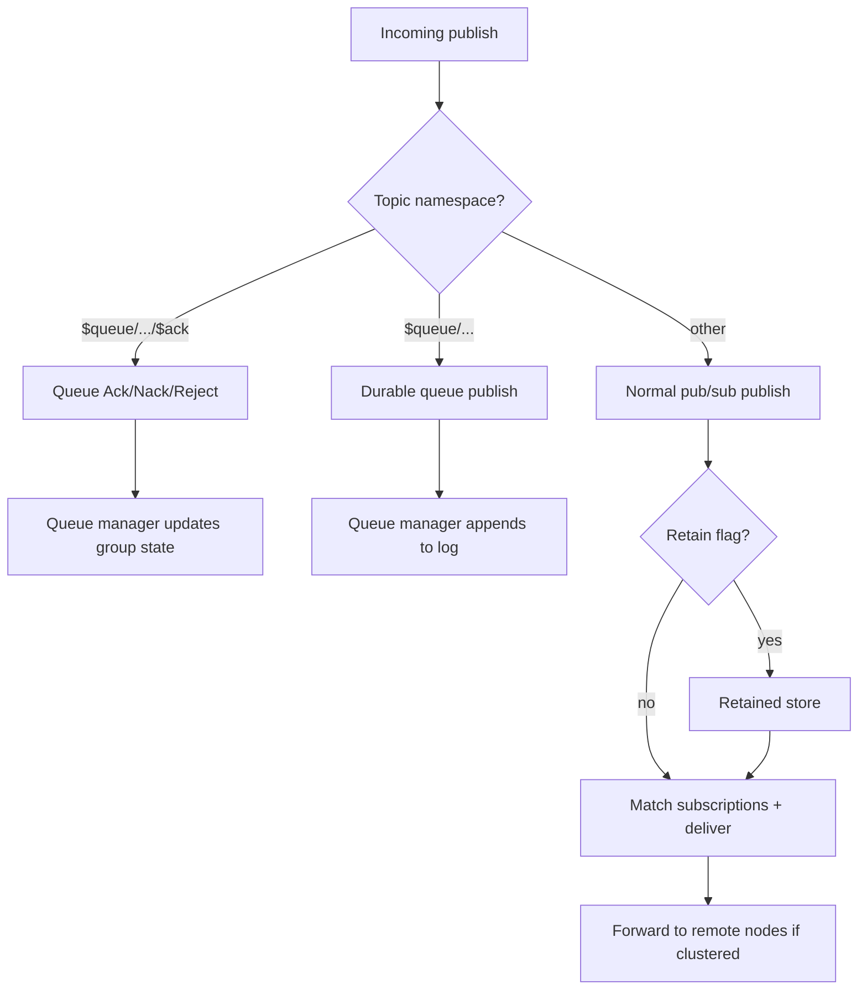
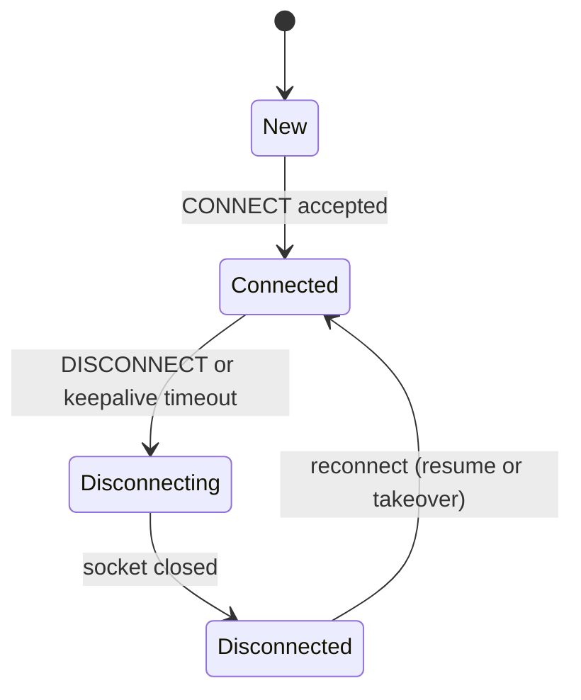
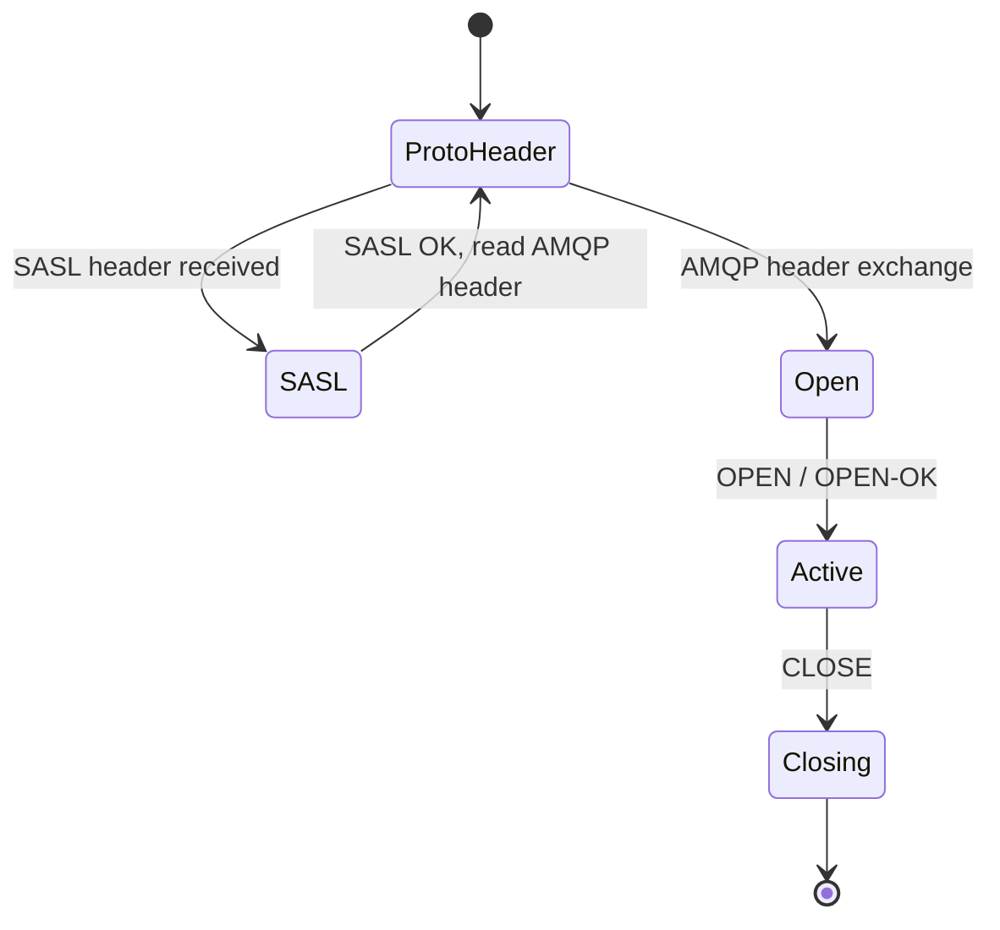
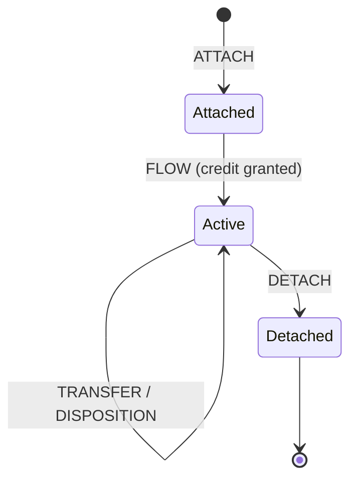
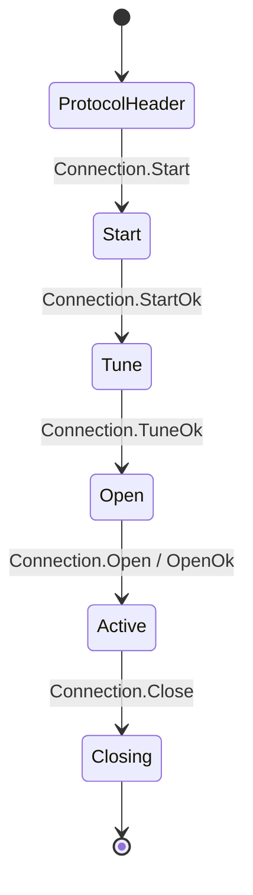
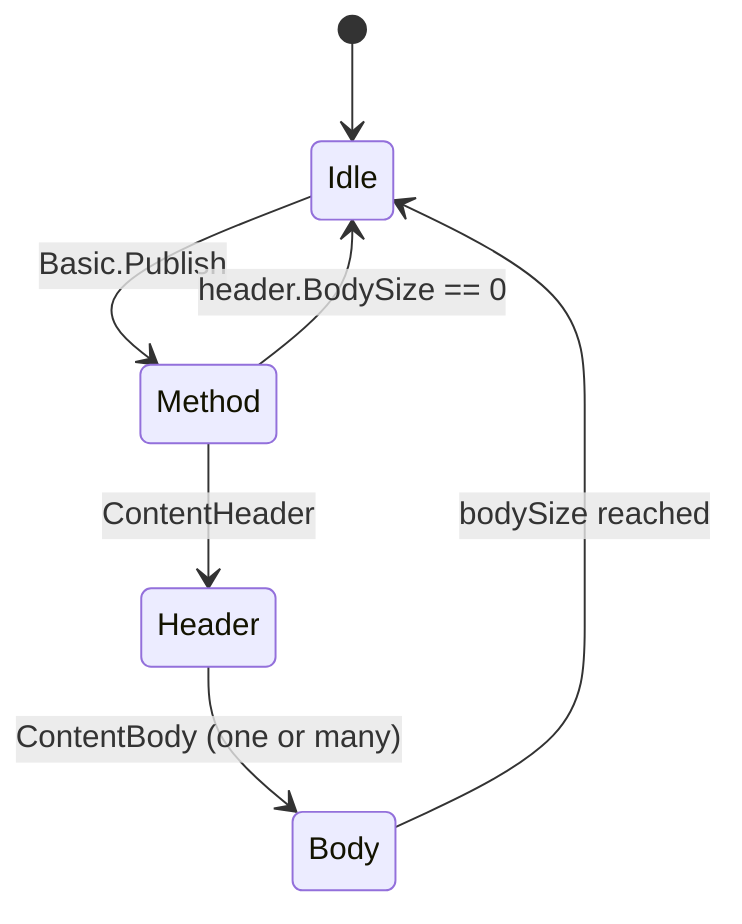
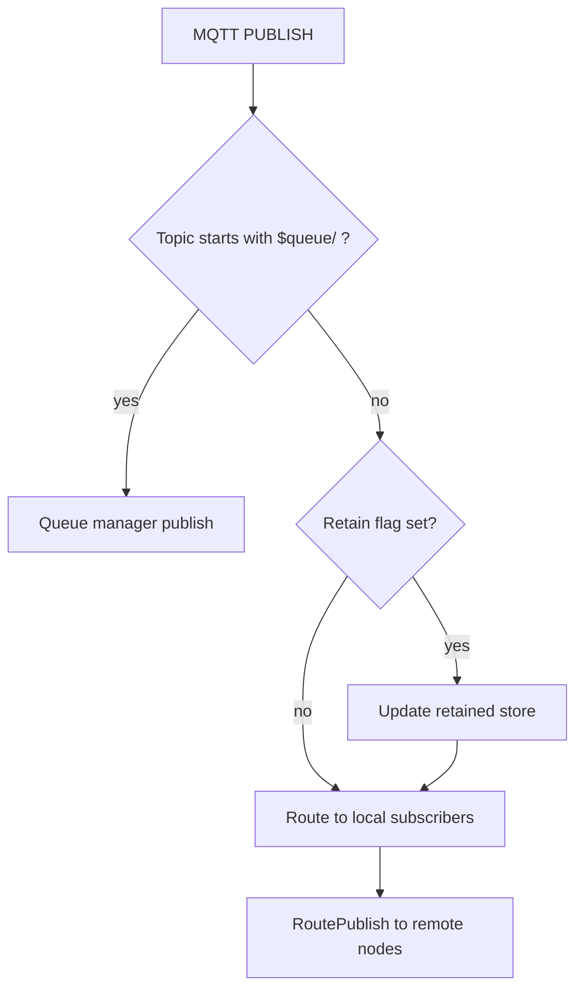

# Routing Internals

**Last Updated:** 2026-02-05

FluxMQ ships three protocol brokers that share the same durable queue manager:

- **MQTT Broker**: `mqtt/broker/`
- **AMQP 1.0 Broker**: `amqp1/broker/`
- **AMQP 0.9.1 Broker**: `amqp/broker/`

Each broker has its own connection model and state machine, but they all converge on the same internal concepts:

- A **topic router** for pub/sub fan-out.
- A **queue manager** for durable queues and consumer groups.
- A **cluster router** for cross-node routing (when clustering is enabled).

This page focuses on the logic behind those routing decisions, and where special topic namespaces fit in.

## Topic Namespaces (Special Topics)

FluxMQ uses MQTT-style topics across protocols. Some topic namespaces have special meaning:

| Namespace | What It Means | Notes |
| --- | --- | --- |
| `$SYS/...` | Broker stats and health telemetry | Published periodically as retained messages. |
| `$queue/<name>/...` | Durable queue traffic | Routed to the queue manager (not normal pub/sub). |
| `$queue/.../$ack|$nack|$reject` | Queue acknowledgments | Consumers publish these to drive Ack/Nack/Reject. |
| `$share/<group>/<filter>` | Shared subscriptions (MQTT) | Load-balances pub/sub delivery inside a share group. |
| `$dlq/...` | Dead-letter namespace | A handler exists, but automatic DLQ routing is not fully wired yet. |

## Routing Decision (High Level)

At publish time, brokers classify traffic first, then take the appropriate path:

## MQTT Broker

**Responsibilities**

- Manage MQTT sessions (clean start, expiry, inflight tracking, offline queue)
- Route messages to local subscribers via the topic router
- Persist retained messages and wills
- Enforce QoS rules and MaxQoS downgrade
- Integrate with the queue manager for `$queue/` topics
- Integrate with clustering for cross-node routing and session takeover
- Emit webhook events (optional)

### MQTT Pub/Sub Routing

For “normal” topics (everything except `$queue/...`), MQTT routing is classic broker behavior:

- Subscribe registers a filter in the topic router (plus optional shared-subscription grouping).
- Publish matches filters and delivers to local sessions.
- In clustered mode, the broker forwards publishes to nodes that own matching sessions.

### Durable Queue Routing (`$queue/`)

Queue topics are not handled by the pub/sub router.

Instead, `$queue/<name>/...` is treated as a durable enqueue into the queue manager:

- The queue name is the first path segment after `$queue/`.
- The remainder of the topic is treated as the queue “routing key” and can be used for pattern filtering inside a queue.
- The queue manager stores a durable log entry and then delivers it to consumers in a consumer group.

### Queue Acknowledgments (`$ack/$nack/$reject`)

Queue deliveries include metadata that makes acknowledgments protocol-agnostic:

- `message-id` (formatted like `<queue>:<offset>`)
- `group-id` (the consumer group handling the delivery)
- `queue` (the queue name)
- `offset` (the sequence number)

To acknowledge a delivery over MQTT v5, publish to the delivery topic plus one of:

- `/$ack` to confirm processing
- `/$nack` to request redelivery
- `/$reject` to drop (DLQ handling is not fully wired yet)

The broker reads `message-id` and `group-id` from MQTT v5 user properties and applies the operation to the queue manager.

**Session Lifecycle (High Level)**

- CONNECT arrives over a transport (TCP or WebSocket)
- Broker creates or resumes the session based on `clean_start` and expiry
- Session state is restored from storage if needed
- In clustered mode, session ownership is acquired and takeover is handled
- On disconnect, offline queue is persisted (if session not expired)

### MQTT Session FSM

This is the actual session state model used by `mqtt/session/session.go`. The broker goes from `New` directly to `Connected` once a connection is attached. `StateConnecting` exists but is not currently set by the broker.

**Message Routing (MQTT)**

Topic matching is trie-based. Retained messages are stored and replayed on subscribe. Shared subscriptions (`$share/...`) are grouped and then routed through the same matcher, but delivery within a share group is load-balanced.

## AMQP 1.0 Broker

**Responsibilities**

- Handle AMQP 1.0 protocol handshake (protocol header, optional SASL, OPEN)
- Manage sessions, links, and flow control windows
- Route non-queue links through the shared router
- Map queue links to the queue manager (capability-based or `$queue/` prefix)

### AMQP 1.0 Connection FSM (Broker Perspective)

### AMQP 1.0 Link FSM (Simplified)

Links are the unit of subscription/publish. The broker treats a link as a queue link if the peer advertises the `queue` capability or if the address starts with `$queue/`.

## AMQP 0.9.1 Broker

**Responsibilities**

- Handle AMQP 0.9.1 connection handshake and channel lifecycle
- Accumulate publish content frames (method -> header -> body)
- Route non-queue publishes through the shared router
- Map queue publishes and consumes to the queue manager

### AMQP 0.9.1 Connection FSM (Handshake)

### AMQP 0.9.1 Publish Content FSM (Channel-Level)

The broker accumulates content frames in `amqp/broker/channel.go`. Any out-of-order or inconsistent frames trigger a channel close.

**Queue Mapping (AMQP 0.9.1)**

AMQP 0.9.1 frames are assembled into a single publish, then routed as either:

- Pub/sub delivery (normal AMQP routing model inside FluxMQ’s broker adapter).
- Durable queue traffic (when the address/routing key is treated as queue-capable).

## Walkthroughs

**MQTT publish path**

1. Broker receives PUBLISH and checks `$queue/` topics and queue acks.
2. Queue topics are forwarded to the queue manager (ack topics are handled separately).
3. Non-queue topics update retained state (if retain flag set).
4. Local router matches subscribers and delivers.
5. Cluster router forwards to remote nodes with matching subscriptions.

**AMQP 1.0 receive path (queue vs pub/sub)**

1. Client attaches a link. If it advertises the `queue` capability or uses `$queue/`, it is treated as a queue link.
2. Incoming transfers on queue links are converted into queue publishes.
3. Non-queue links are routed through the AMQP router and optionally forwarded via cluster.

**AMQP 0.9.1 publish path**

1. `Basic.Publish` sets the pending method.
2. A content header and body frames are assembled into a single message.
3. Default exchange + `$queue/` routing key goes to the queue manager.
4. Otherwise the message is routed to local AMQP subscribers.

## Where To Look Next

- Durable queues: `/docs/messaging/durable-queues`
- Storage internals: `/docs/architecture/storage`
- Clustering internals: `/docs/architecture/clustering-internals`

## Optional Subsystems

- **Auth/Authz**: pluggable interfaces in `broker/auth.go`
- **Rate limiting**: per-IP and per-client limits in `ratelimit/`
- **Webhooks**: event delivery via `broker/webhook/`
- **OTel metrics/tracing**: optional, configured via `server` settings

## Configuration Pointers

- `broker.*` for broker limits (max message size, max QoS, retry policy)
- `session.*` for session storage and offline queue limits
- `ratelimit.*` for rate limiting
- `webhook.*` for webhook delivery

See `/docs/reference/configuration-reference` for full details.
