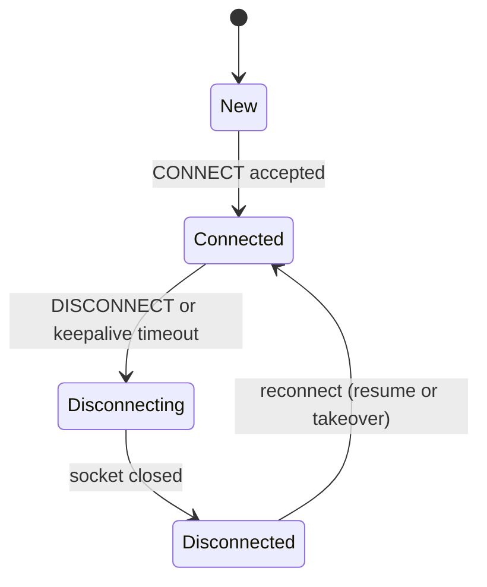
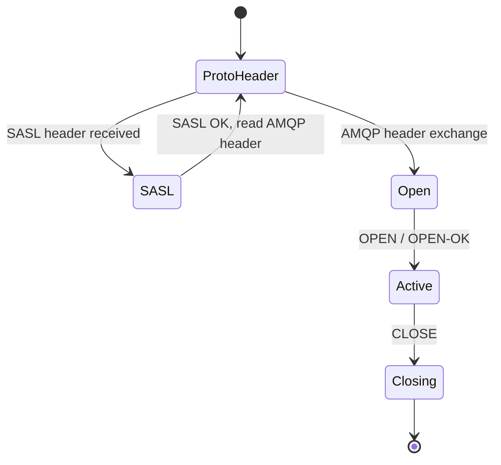
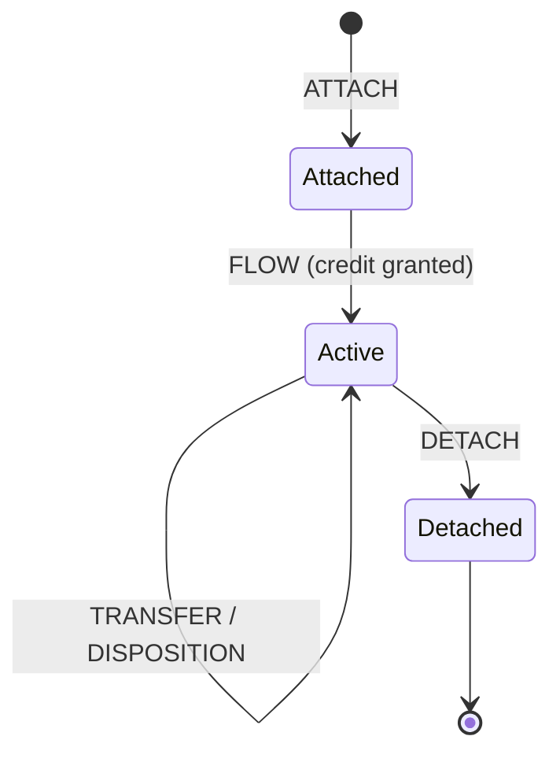
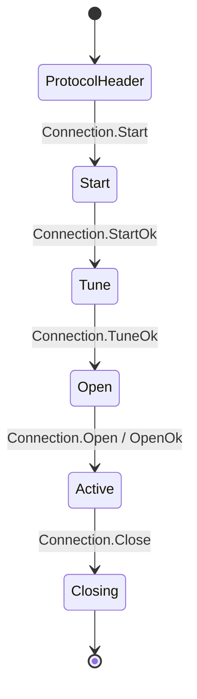
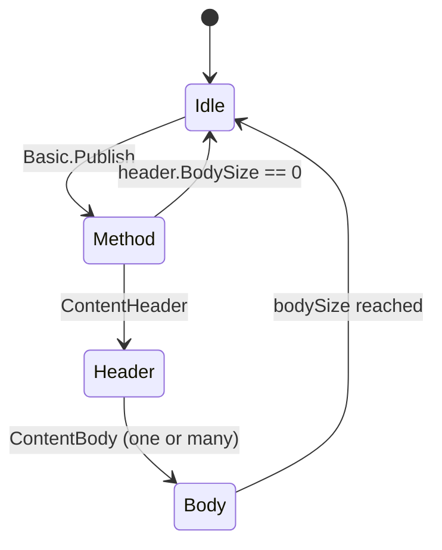
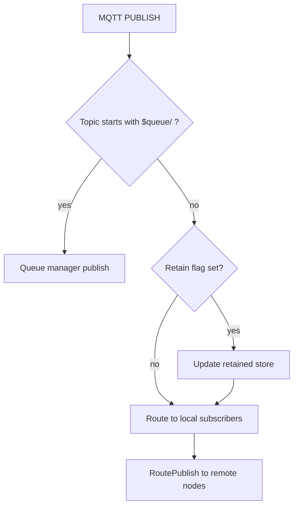

# Broker Internals

**Last Updated:** 2026-02-05

FluxMQ ships three broker implementations that share the same queue manager:

- **MQTT Broker**: `mqtt/broker/`
- **AMQP 1.0 Broker**: `amqp1/broker/`
- **AMQP 0.9.1 Broker**: `amqp/broker/`

Each broker has its own connection model and state machine, but they all route durable queue traffic into the shared queue manager. This page focuses on how each broker behaves and how to reason about its FSM.

## MQTT Broker

**Responsibilities**

- Manage MQTT sessions (clean start, expiry, inflight tracking, offline queue)
- Route messages to local subscribers via the topic router
- Persist retained messages and wills
- Enforce QoS rules and MaxQoS downgrade
- Integrate with the queue manager for `$queue/` topics
- Integrate with clustering for cross-node routing and session takeover
- Emit webhook events (optional)

**Session Lifecycle (High Level)**

- CONNECT arrives over a transport (TCP or WebSocket)
- Broker creates or resumes the session based on `clean_start` and expiry
- Session state is restored from storage if needed
- In clustered mode, session ownership is acquired and takeover is handled
- On disconnect, offline queue is persisted (if session not expired)

### MQTT Session FSM

This is the actual session state model used by `mqtt/session/session.go`. The broker goes from `New` directly to `Connected` once a connection is attached. `StateConnecting` exists but is not currently set by the broker.

**Message Routing (MQTT)**

- Topic matching uses a trie-based router in `broker/router/`
- Shared subscriptions (MQTT 5.0) are handled by the shared subscription manager
- Retained messages are stored in the retained store and delivered on subscribe
- Queue topics (`$queue/...`) are routed to the queue manager
- Queue acks (`$queue/.../$ack|$nack|$reject`) are handled separately and do not enter normal pub/sub routing

## AMQP 1.0 Broker

**Responsibilities**

- Handle AMQP 1.0 protocol handshake (protocol header, optional SASL, OPEN)
- Manage sessions, links, and flow control windows
- Route non-queue links through the shared router
- Map queue links to the queue manager (capability-based or `$queue/` prefix)

### AMQP 1.0 Connection FSM (Broker Perspective)

### AMQP 1.0 Link FSM (Simplified)

Links are the unit of subscription/publish. The broker treats a link as a queue link if the peer advertises the `queue` capability or if the address starts with `$queue/`.

## AMQP 0.9.1 Broker

**Responsibilities**

- Handle AMQP 0.9.1 connection handshake and channel lifecycle
- Accumulate publish content frames (method -> header -> body)
- Route non-queue publishes through the shared router
- Map queue publishes and consumes to the queue manager

### AMQP 0.9.1 Connection FSM (Handshake)

### AMQP 0.9.1 Publish Content FSM (Channel-Level)

The broker accumulates content frames in `amqp/broker/channel.go`. Any out-of-order or inconsistent frames trigger a channel close.

**Queue Mapping (AMQP 0.9.1)**

- Default exchange + routing key starting with `$queue/` is treated as a queue publish.
- Stream commits use `$queue/<queue>/$commit` with `x-group-id` and `x-offset` headers.

## Walkthroughs

**MQTT publish path**

1. Broker receives PUBLISH and checks `$queue/` topics and queue acks.
2. Queue topics are forwarded to the queue manager (ack topics are handled separately).
3. Non-queue topics update retained state (if retain flag set).
4. Local router matches subscribers and delivers.
5. Cluster router forwards to remote nodes with matching subscriptions.

**AMQP 1.0 receive path (queue vs pub/sub)**

1. Client attaches a link. If it advertises the `queue` capability or uses `$queue/`, it is treated as a queue link.
2. Incoming transfers on queue links are converted into queue publishes.
3. Non-queue links are routed through the AMQP router and optionally forwarded via cluster.

**AMQP 0.9.1 publish path**

1. `Basic.Publish` sets the pending method.
2. A content header and body frames are assembled into a single message.
3. Default exchange + `$queue/` routing key goes to the queue manager.
4. Otherwise the message is routed to local AMQP subscribers.

## Where To Look Next

- Queue routing details: `docs/queue.md`
- Log storage internals: `docs/logstorage.md`
- Cluster routing and etcd metadata: `docs/clustering.md`

## Optional Subsystems

- **Auth/Authz**: pluggable interfaces in `broker/auth.go`
- **Rate limiting**: per-IP and per-client limits in `ratelimit/`
- **Webhooks**: event delivery via `broker/webhook/`
- **OTel metrics/tracing**: optional, configured via `server` settings

## Configuration Pointers

- `broker.*` for broker limits (max message size, max QoS, retry policy)
- `session.*` for session storage and offline queue limits
- `ratelimit.*` for rate limiting
- `webhook.*` for webhook delivery

See `docs/configuration.md` for full details.
