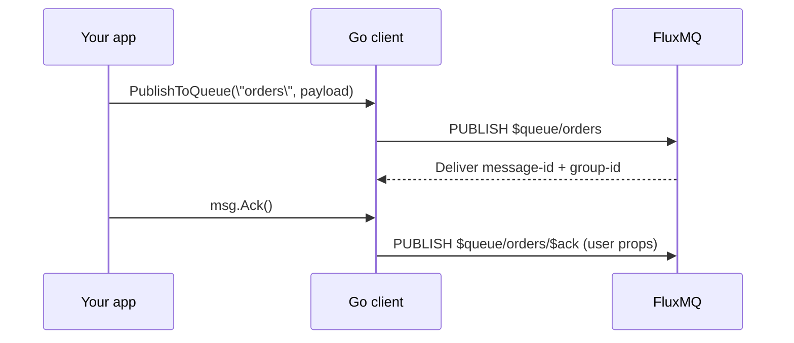

# Go Client

Pure Go client libraries for MQTT 3.1.1/5.0 and AMQP 0.9.1 with durable queue support.
Note: FluxMQ also exposes AMQP 1.0 server support, but this repository does not
currently include a dedicated AMQP 1.0 client library.

---

## Features

- **Protocol Support:** MQTT 3.1.1 (v4) and MQTT 5.0 (v5)
- **Auto-Reconnect:** Exponential backoff with configurable limits
- **QoS Levels:** Full QoS 0/1/2 support with pluggable in-flight store (memory by default)
- **TLS/SSL:** Secure connections with custom certificates
- **Session Persistence:** Configurable session expiry
- **Durable Queues:** Consumer groups and acknowledgments (DLQ wiring pending)
- **MQTT 5.0 Features:** Topic aliases, user properties (publish/receive/will), flow control

---

## MQTT Client

## Quick Start

### Basic Connection

```go
package main

import (
    "log"
    "github.com/absmach/fluxmq/client"
)

func main() {
    // Create client with options
    opts := client.NewOptions().
        SetServers("localhost:1883").
        SetClientID("my-client").
        SetProtocolVersion(5).
        SetOnMessage(func(topic string, payload []byte, qos byte) {
            log.Printf("Received: %s -> %s", topic, string(payload))
        })

    c := client.New(opts)

    // Connect
    if err := c.Connect(); err != nil {
        log.Fatal(err)
    }
    defer c.Disconnect()

    // Subscribe
    if err := c.SubscribeSingle("sensors/#", 1); err != nil {
        log.Fatal(err)
    }

    // Publish
    if err := c.Publish("sensors/temp", []byte("22.5"), 1, false); err != nil {
        log.Fatal(err)
    }

    // Keep running
    select {}
}
```

---

## Configuration Options

### Connection Settings

```go
opts := client.NewOptions().
    SetServers("broker1:1883", "broker2:1883").  // Multiple servers
    SetClientID("device-001").
    SetCredentials("user", "password").
    SetTLSConfig(&tls.Config{...}).              // Enable TLS
    SetConnectTimeout(10 * time.Second).
    SetKeepAlive(60 * time.Second)
```

### Protocol Version

```go
opts.SetProtocolVersion(4)  // MQTT 3.1.1
opts.SetProtocolVersion(5)  // MQTT 5.0
```

### Session Options

```go
opts.SetCleanSession(true)   // Start fresh each connect
opts.SetCleanSession(false)  // Resume previous session
opts.SetSessionExpiry(3600)  // Session persists 1 hour after disconnect (v5)
```

### MQTT 5.0 Specific

```go
opts.SetSessionExpiry(86400).         // Session expires in 24h
    SetReceiveMaximum(100).           // Max inflight messages to receive
    SetMaximumPacketSize(1048576).    // Max 1MB packets
    SetTopicAliasMaximum(10).         // Enable topic aliases
    SetRequestResponseInfo(true).     // Request response info
    SetRequestProblemInfo(true)       // Get detailed errors
```

### Reconnection

```go
opts.SetAutoReconnect(true)                   // Enable auto-reconnect
opts.ReconnectBackoff = 1 * time.Second       // Initial delay
opts.MaxReconnectWait = 2 * time.Minute       // Max delay
```

---

## Publishing Messages

### Basic Publish

```go
// QoS 0 - Fire and forget
c.Publish("topic", []byte("payload"), 0, false)

// QoS 1 - At least once
c.Publish("topic", []byte("payload"), 1, false)

// QoS 2 - Exactly once
c.Publish("topic", []byte("payload"), 2, false)

// Retained message
c.Publish("config/device", []byte("settings"), 1, true)
```

### MQTT 5.0 Publish Properties

Use `PublishMessage` to set publish properties such as content type, response
topic, correlation data, and user properties (MQTT 5.0 only).

```go
msg := &client.Message{
    Topic:           "sensors/temp",
    Payload:         []byte("22.5"),
    QoS:             1,
    ContentType:     "text/plain",
    ResponseTopic:   "responses/temp",
    CorrelationData: []byte("req-123"),
    UserProperties:  map[string]string{"unit": "celsius"},
}
if err := c.PublishMessage(msg); err != nil {
    log.Fatal(err)
}
```

---

## Subscribing to Topics

### Basic Subscription

```go
// Single topic
c.SubscribeSingle("sensors/temp", 1)

// Multiple topics
c.Subscribe(map[string]byte{
    "sensors/#":    1,
    "devices/+/status": 2,
})
```

### MQTT 5.0 Subscription Options

```go
opts := &client.SubscribeOption{
    Topic:            "sensors/temp",
    QoS:              1,
    NoLocal:          true,   // Don't receive own messages
    RetainAsPublished: true,  // Keep original retain flag
    RetainHandling:   1,      // Only send retained if new sub
    SubscriptionID:   42,     // Track subscription
}
c.SubscribeWithOptions(opts)
```

### Unsubscribe

```go
c.Unsubscribe("sensors/temp")
```

---

## Message Handling

### Simple Handler

```go
opts.SetOnMessage(func(topic string, payload []byte, qos byte) {
    log.Printf("[%s] QoS %d: %s", topic, qos, payload)
})
```

### Full Message Context (MQTT 5.0)

```go
opts.SetOnMessageV2(func(msg *client.Message) {
    log.Printf("Topic: %s", msg.Topic)
    log.Printf("Payload: %s", msg.Payload)
    log.Printf("QoS: %d", msg.QoS)
    log.Printf("Retain: %v", msg.Retain)
    log.Printf("Properties: %+v", msg.UserProperties)
    log.Printf("Response Topic: %s", msg.ResponseTopic)
})
```

---

## Durable Queues

The client supports durable queues with consumer groups and message acknowledgment.
Reject/DLQ wiring in the broker is pending.
MQTT v3 can publish and subscribe to queue topics, but acknowledgments require MQTT v5 user properties.

Use queues when you want “workers processing a durable backlog” rather than “everyone who is subscribed gets a copy”.

On the wire, the Go client maps queue operations to MQTT v5 conventions:

- Publishing to queue `orders` becomes a publish to topic `$queue/orders`.
- Subscribing to a queue sets the consumer group with the MQTT v5 `consumer-group` user property.
- Acknowledgments publish to `$queue/<queue>/$ack|$nack|$reject` and attach `message-id` and `group-id` as MQTT v5 user properties.



### Publishing to Queues

```go
// Simple queue publish
c.PublishToQueue("orders", []byte(`{"item": "widget"}`))

// Full control
c.PublishToQueueWithOptions(&client.QueuePublishOptions{
    QueueName:    "events",
    Payload:      []byte("event-data"),
    Properties:   map[string]string{"priority": "high"},
    QoS:          1,
})
```

### Subscribing to Queues

```go
// Subscribe with consumer group
err := c.SubscribeToQueue("orders", "order-processors", func(msg *client.QueueMessage) {
    log.Printf("Processing order: %s", msg.Payload)
    log.Printf("Message ID: %s", msg.MessageID)
    log.Printf("Group: %s", msg.GroupID)
    log.Printf("Offset: %d", msg.Offset)
    
    // Process message...
    if processedOK {
        msg.Ack()  // Message removed from queue
    } else if shouldRetry {
        msg.Nack() // Redelivery eligible (subject to broker delivery/visibility timing)
    } else {
        msg.Reject() // Removes from pending; DLQ routing not wired yet
    }
})
```

### Message Acknowledgment

| Method         | Effect                                             |
| -------------- | -------------------------------------------------- |
| `msg.Ack()`    | Message processed successfully, removed from queue |
| `msg.Nack()`   | Processing failed, make eligible for redelivery    |
| `msg.Reject()` | Remove from pending; DLQ routing not wired yet     |

### Direct Acknowledgment

```go
// Acknowledge by message ID (explicit group)
c.AckWithGroup("orders", "msg-12345", "processors")
c.NackWithGroup("orders", "msg-12345", "processors")
c.RejectWithGroup("orders", "msg-12345", "processors")
```
Note: MQTT queue acknowledgments require MQTT v5 and the broker expects
`message-id` and `group-id` user properties on ack messages. `QueueMessage.Ack()`
sends both when they are present on incoming messages.

### Unsubscribe from Queue

```go
c.UnsubscribeFromQueue("orders")
```

### Queue Code Example

```go
package main

import (
    "log"
    "github.com/absmach/fluxmq/client"
)

func main() {
    opts := client.NewOptions().
        SetServers("localhost:1883").
        SetClientID("order-processor").
        SetProtocolVersion(5)

    c := client.New(opts)
    if err := c.Connect(); err != nil {
        log.Fatal(err)
    }
    defer c.Disconnect()

    // Subscribe to order queue with consumer group
    err := c.SubscribeToQueue("orders", "processors", func(msg *client.QueueMessage) {
        log.Printf("Order received: %s", msg.Payload)
        
        // Simulate processing
        if processOrder(msg.Payload) {
            if err := msg.Ack(); err != nil {
                log.Printf("Ack failed: %v", err)
            }
        } else {
            msg.Nack() // Retry later
        }
    })
    if err != nil {
        log.Fatal(err)
    }

    // Publish some orders
    for i := 0; i < 10; i++ {
        c.PublishToQueue("orders", []byte(`{"id": "`+string(rune(i))+`"}`))
    }

    select {} // Keep running
}

func processOrder(payload []byte) bool {
    // Process order logic
    return true
}
```

---

## Connection Lifecycle

### Callbacks

```go
opts.SetOnConnect(func() {
    log.Println("Connected!")
}).
SetOnConnectionLost(func(err error) {
    log.Printf("Connection lost: %v", err)
}).
SetOnReconnecting(func(attempt int) {
    log.Printf("Reconnecting (attempt %d)...", attempt)
}).
SetOnServerCapabilities(func(caps *client.ServerCapabilities) {
    log.Printf("Server max QoS: %d", caps.MaximumQoS)
    log.Printf("Server retain available: %v", caps.RetainAvailable)
})
```

### Disconnect

```go
// Normal disconnect
c.Disconnect()

// With reason (MQTT 5.0)
c.DisconnectWithReason(0x04, 0, "Going offline")
```

---

## Will Messages

Configure a last-will message sent when the client disconnects unexpectedly:

```go
opts.SetWill("clients/device-001/status", []byte("offline"), 1, true)
```

### With MQTT 5.0 Properties

```go
opts.Will = &client.WillMessage{
    Topic:             "clients/device-001/status",
    Payload:           []byte("offline"),
    QoS:               1,
    Retain:            true,
    WillDelayInterval: 30,  // Wait 30s before sending
    MessageExpiry:     3600,
    UserProperties:    map[string]string{"reason": "unexpected"},
}
```

---

## Error Handling

### Common Errors

| Error                     | Cause                                      |
| ------------------------- | ------------------------------------------ |
| `ErrNotConnected`         | Operation attempted while disconnected     |
| `ErrNoServers`            | No broker addresses configured             |
| `ErrEmptyClientID`        | ClientID not set                           |
| `ErrInvalidProtocol`      | Protocol version must be 4 or 5            |
| `ErrInvalidQoS`           | QoS must be 0, 1, or 2                     |
| `ErrInvalidTopic`         | Empty or invalid topic string              |
| `ErrInvalidMessage`       | Message is nil or invalid                  |
| `ErrMaxInflight`          | Too many pending messages                  |
| `ErrQueueAckRequiresV5`   | Queue acks require MQTT v5 user properties |
| `ErrQueueAckMissingGroup` | `group-id` missing for queue ack           |

### Handling Connection Errors

```go
if err := c.Connect(); err != nil {
    switch err {
    case client.ErrNoServers:
        log.Fatal("No brokers configured")
    case client.ErrEmptyClientID:
        log.Fatal("ClientID required")
    default:
        log.Printf("Connection error: %v", err)
    }
}
```

---

## Message Store

For QoS 1/2 in-flight storage:

```go
store := client.NewMemoryStore()
opts.SetStore(store)
```

Built-in stores:
- **MemoryStore** (default): In-memory, lost on restart

You can implement the `MessageStore` interface to persist QoS 1/2 in-flight data.

---

## Defaults

| Option           | Default Value  |
| ---------------- | -------------- |
| KeepAlive        | 60 seconds     |
| ConnectTimeout   | 10 seconds     |
| WriteTimeout     | 5 seconds      |
| AckTimeout       | 10 seconds     |
| PingTimeout      | 5 seconds      |
| MaxInflight      | 100            |
| MessageChanSize  | 256            |
| AutoReconnect    | true           |
| ReconnectBackoff | 1 second       |
| MaxReconnectWait | 2 minutes      |
| ProtocolVersion  | 4 (MQTT 3.1.1) |
| CleanSession     | true           |

---

## AMQP 0.9.1 Client

The AMQP 0.9.1 client focuses on durable queue interop with the broker. It uses the same queue naming convention as MQTT: pass the queue name without the `$queue/` prefix.

### Quick Start

```go
package main

import (
    "log"

    "github.com/absmach/fluxmq/client/amqp"
)

func main() {
    opts := amqp.NewOptions().
        SetAddress("localhost:5682").
        SetCredentials("guest", "guest")

    c, err := amqp.New(opts)
    if err != nil {
        log.Fatal(err)
    }

    if err := c.Connect(); err != nil {
        log.Fatal(err)
    }
    defer c.Close()

    // Subscribe to a queue with a consumer group
    err = c.SubscribeToQueue("tasks/orders", "order-shipper", func(msg *amqp.QueueMessage) {
        log.Printf("Received: %s", string(msg.Body))
        _ = msg.Ack()
    })
    if err != nil {
        log.Fatal(err)
    }

    // Publish to the same queue
    if err := c.PublishToQueue("tasks/orders", []byte("hello")); err != nil {
        log.Fatal(err)
    }

    select {}
}
```

### Queue Semantics

- `SubscribeToQueue` passes the consumer group via `x-consumer-group` on `basic.consume`.
- `Ack`, `Nack`, and `Reject` map to `basic.ack`, `basic.nack`, and `basic.reject`.

### Stream Queues (RabbitMQ-Compatible)

Stream queues provide log-style consumption with cursor offsets.
Stream queue names follow RabbitMQ conventions (no `$queue/` prefix).
Offsets are passed as `x-stream-offset` strings; values like `first`, `last`,
`next`, `offset=<n>`, `timestamp=<unix>` are interpreted by the broker.

```go
// Declare a stream queue
qName, err := c.DeclareStreamQueue(&amqp.StreamQueueOptions{
    Name:          "events",
    Durable:       true,
    MaxAge:        "7D",
    MaxLengthBytes: 10 * 1024 * 1024 * 1024,
})
if err != nil {
    log.Fatal(err)
}
log.Printf("stream queue: %s", qName)

// Consume from the beginning
err = c.SubscribeToStream(&amqp.StreamConsumeOptions{
    QueueName: "events",
    Offset:    "first",
}, func(msg *amqp.QueueMessage) {
    if off, ok := msg.StreamOffset(); ok {
        log.Printf("offset=%d payload=%s", off, string(msg.Body))
    }
    _ = msg.Ack()
})
if err != nil {
    log.Fatal(err)
}

// Publish to the stream queue (RabbitMQ-style)
if err := c.PublishToStream("events", []byte("hello"), nil); err != nil {
    log.Fatal(err)
}
```

Stream deliveries include:
- `x-stream-offset`
- `x-stream-timestamp`
- `x-work-acked` / `x-work-committed-offset`

The `x-work-*` fields report the configured primary work group's committed offset.
`x-work-acked` is `true` when this message's offset is below the committed offset,
which can lag slightly due to auto-commit interval batching.
Convenience accessors are available on `QueueMessage`:
`StreamOffset()`, `StreamTimestamp()`, `WorkAcked()`, `WorkCommittedOffset()`, `WorkGroup()`.

### Manual Commit Mode

By default, stream consumers auto-commit offsets as messages are delivered
(similar to Kafka's `enable.auto.commit=true`). For exactly-once processing,
disable auto-commit and commit explicitly.

Auto-commit is rate-limited by the server setting
`queue_manager.auto_commit_interval` (default: `5s`).

Minimal example:

```go
autoCommit := false
_ = c.SubscribeToStream(&amqp.StreamConsumeOptions{
    QueueName:     "events",
    ConsumerGroup: "my-group",
    AutoCommit:    &autoCommit,
}, handler)

_ = c.CommitOffset("events", "my-group", lastProcessedOffset)
```

Use the same consumer group name in both calls.

With manual commit:
- Messages are delivered but the committed offset doesn't advance automatically
- On reconnect, delivery resumes from the last committed offset
- Use `CommitOffset()` to advance the committed position

### Pub/Sub

```go
_ = c.Subscribe("sensors/#", func(msg *amqp.Message) {
    log.Printf("Topic: %s Payload: %s", msg.Topic, string(msg.Body))
})

_ = c.Publish("sensors/temp", []byte("22.5"))
```

### Reconnection

```go
opts.SetAutoReconnect(true).
    SetReconnectBackoff(1 * time.Second).
    SetMaxReconnectWait(2 * time.Minute).
    SetOnConnectionLost(func(err error) { log.Printf("lost: %v", err) }).
    SetOnReconnecting(func(attempt int) { log.Printf("reconnect attempt %d", attempt) })
```
