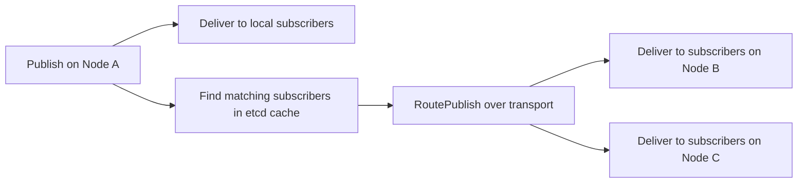
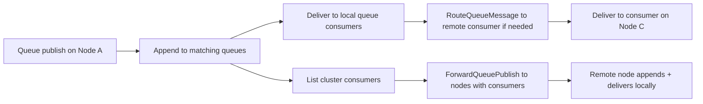

# Clustering

**Last Updated:** 2026-02-05

FluxMQ supports optional clustering for high availability and cross-node routing. Clustering is embedded and uses etcd for metadata coordination plus gRPC for inter-broker transport.

## What Clustering Provides

- **Session ownership** across nodes
- **Subscription routing** for cross-node publishes
- **Queue consumer registry** for cross-node queue delivery
- **Retained/will storage** with a hybrid metadata + payload strategy
- **Session takeover** when a client reconnects to a different node

## Core Components

- **Embedded etcd**: stores session ownership, subscriptions, queue consumers, retained metadata
- **Transport (gRPC)**: routes publishes, queue deliveries, retained/will fetches
- **Optional Raft for queues**: configurable replication for queue appends

## etcd Role (Metadata Plane)

etcd is the **source of truth for cluster metadata**. It is not used for message payloads directly (payloads live in local stores), but it decides who owns what and where to route traffic.

Key responsibilities:

- **Session ownership** with a lease (`/mqtt/sessions/<client>/owner`)
- **Subscription registry** for cross-node routing (`/mqtt/subscriptions/<client>/<filter>`)
- **Queue consumer registry** for cross-node queue delivery (`/mqtt/queue-consumers/<queue>/<group>/<consumer>`)
- **Retained and will metadata** for hybrid storage (`/mqtt/retained-data`, `/mqtt/retained-index`, `/mqtt/will-data`, `/mqtt/will-index`)
- **Leader election** (`/mqtt/leader`) for background tasks

Quick keyspace map:

| Prefix | Purpose |
| --- | --- |
| `/mqtt/sessions/` | Session ownership and takeover |
| `/mqtt/subscriptions/` | Global subscription registry |
| `/mqtt/queue-consumers/` | Queue consumer registry |
| `/mqtt/retained-data` | Small retained payloads (replicated) |
| `/mqtt/retained-index` | Large retained metadata (fetch on demand) |
| `/mqtt/will-data` | Small will payloads (replicated) |
| `/mqtt/will-index` | Large will metadata (fetch on demand) |
| `/mqtt/leader` | Leader election |

Notes:

- When hybrid retained/will storage is disabled, legacy prefixes (`/mqtt/retained` and `/mqtt/wills`) are used.
- Session ownership keys are written with an etcd lease. If a node dies, its lease expires and ownership is released automatically.

## Inter-Node Routing (How Messages Move)

There are two routing planes: **pub/sub** and **queues**. Both use the Connect-based gRPC transport for node-to-node delivery.

### Pub/Sub Routing (MQTT and AMQP 1.0)



### Queue Routing (Durable Queues)



## Session Takeover (MQTT)

When a client reconnects to a different node, the new node requests session state from the old owner via the transport layer and then acquires ownership in etcd. This avoids split-brain sessions and keeps inflight/offline state consistent.

## Walkthroughs

**Cross-node publish**

1. A client publishes on Node A.
2. Node A delivers to local subscribers.
3. Node A queries the subscription cache and forwards to nodes with matches.
4. Remote nodes deliver to their local subscribers.

**Queue publish across nodes**

1. A queue publish arrives on Node A.
2. Node A appends to local matching queues.
3. Node A checks the queue-consumer registry and forwards to nodes with consumers.
4. Remote nodes append locally and deliver to their consumers.

## Configuration (Minimal)

```yaml
cluster:
  enabled: true
  node_id: "broker-1"

  etcd:
    data_dir: "/tmp/fluxmq/etcd"
    bind_addr: "0.0.0.0:2380"
    client_addr: "0.0.0.0:2379"
    initial_cluster: "broker-1=http://0.0.0.0:2380"
    bootstrap: true

  transport:
    bind_addr: "0.0.0.0:7948"
    peers: {}
```

For full cluster options (TLS, Raft, hybrid retained settings), see `docs/configuration.md`.

## Message Routing (High Level)

- On publish, the broker routes to local subscribers and calls the cluster router to forward to remote nodes with matching subscriptions.
- Retained and will messages use a hybrid store: metadata in etcd, payloads stored locally for larger messages.
- When a client reconnects to a different node, the new node requests session takeover from the previous owner.

## Queue Delivery Across Nodes

Queue consumers are registered in the cluster. When a queue publish occurs, the queue manager determines which nodes host matching consumers and forwards delivery to those nodes.

## Notes

- Clustering is optional; single-node mode uses in-memory or BadgerDB storage.
- Queue replication is optional and controlled via `cluster.raft`.
