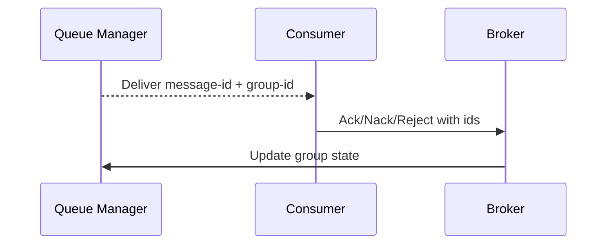

# Consumer Groups

**Last Updated:** 2026-02-05

Consumer groups provide load-balanced consumption for durable queues.

You can think of a group as “one logical consumer” that may be backed by many processes:

- FluxMQ delivers each message to exactly one member of the group.
- The group tracks progress (cursor/committed offsets).
- In classic mode, the group tracks pending messages (PEL) to support redelivery and work stealing.

## Setting a Consumer Group

How you set the group ID depends on the protocol:

- MQTT v5: `consumer-group` user property on SUBSCRIBE.
- MQTT v3: group defaults to client ID (acks require MQTT v5 user properties).
- AMQP 1.0: `consumer-group` in attach properties.
- AMQP 0.9.1: `x-consumer-group` on `basic.consume`.

If you subscribe with a queue routing-key filter (for example `$queue/orders/images/#`), FluxMQ also incorporates the pattern into internal group tracking so that “same group name, different filter” stays independent.

## Acknowledgments

Queue deliveries include `message-id` and `group-id` properties. Consumers must return these on acknowledgment.

- MQTT v5: publish to the delivery topic plus `/$ack`, `/$nack`, or `/$reject` with `message-id` and `group-id` user properties.
- MQTT v5: publish to `$queue/<queue>/$ack|$nack|$reject` with `message-id` and `group-id` user properties (a routing key segment is allowed but not required).
- AMQP 1.0: disposition mapping: `Accepted -> Ack`, `Released -> Nack`, `Rejected -> Reject`.
- AMQP 0.9.1: `basic.ack`, `basic.nack`, `basic.reject` map to Ack/Nack/Reject.

## Learn More

- `/docs/guides/durable-queues`
