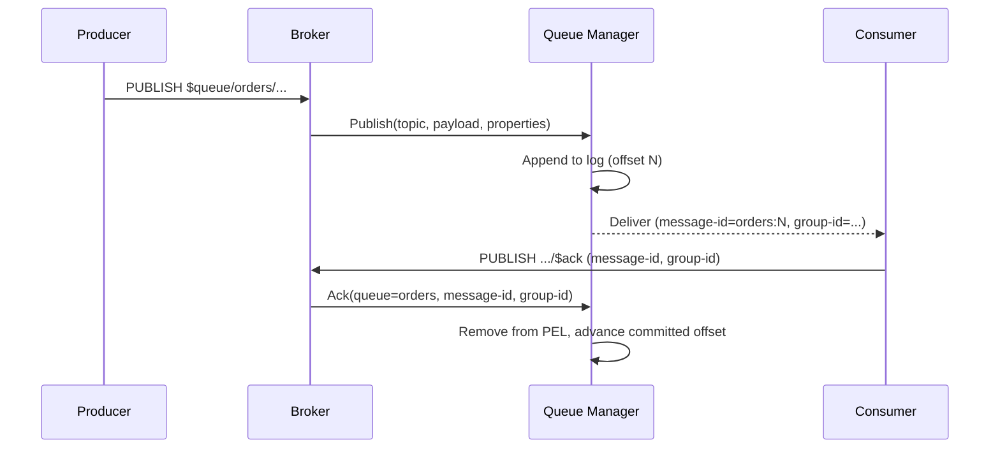

# Durable Queues

**Last Updated:** 2026-02-05

FluxMQ provides durable queues shared across MQTT, AMQP 1.0, and AMQP 0.9.1. The queue manager is append-only with consumer groups and supports both classic work-queue semantics and stream-style consumption.

## Overview

Durable queues are built around a simple model:

- Producers publish to `$queue/<queue-name>/...`.
- The broker appends the message to the queue’s log (durable storage).
- Consumers join a **consumer group** and receive messages from that log.
- Consumers **ack**, **nack**, or **reject** deliveries to control redelivery and truncation.

Queues can operate in two modes:

- **Classic (work queue)**: messages are claimed, tracked in a pending list (PEL), and acknowledged.
- **Stream**: consumers read sequentially with cursor-based progress (replayable log semantics).

## Architecture

```
┌──────────────┐  ┌──────────────┐  ┌───────────────┐
│ MQTT Broker  │  │ AMQP Broker  │  │ AMQP091 Broker│
│ (TCP/WS/     │  │ (AMQP 1.0)   │  │ (AMQP 0.9.1)  │
│ HTTP/CoAP)   │  │              │  │               │
└──────┬───────┘  └───────┬──────┘  └──────┬────────┘
       │                  │                │
       └──────────────────┼────────────────┘
                          ▼
              ┌─────────────────────────┐
              │ Shared Queue Manager    │
              │ - Topic bindings        │
              │ - Consumer groups       │
              │ - Retention loop        │
              └───────────┬─────────────┘
                          ▼
              ┌─────────────────────────┐
              │ Log Storage (AOL)       │
              └─────────────────────────┘
```

## Queue Name, Topic, and Routing Key

Queue topics follow this convention:

- Queue root: `$queue/<name>`
- Routing key: everything after the root (optional)

Examples:

- `$queue/orders` (root only)
- `$queue/orders/created` (routing key `created`)
- `$queue/orders/images/png` (routing key `images/png`)

When you subscribe to `$queue/orders/images/#`, FluxMQ treats:

- queue name: `orders`
- group filter pattern: `images/#`

That pattern is applied inside the queue manager (not in the normal pub/sub router).

## Routing Model (How Messages Find Queues)

FluxMQ uses **topic patterns on queues** to decide where a publish should be stored. This is a fan-out model: one publish can land in multiple queues if multiple patterns match.

- Each queue has one or more topic patterns (MQTT wildcard syntax).
- On publish, the queue manager calls `FindMatchingQueues(topic)` and appends the message to every matching queue.
- If **no queue matches**, FluxMQ creates an **ephemeral queue** whose name and pattern equal the topic, then appends.
- If no queues are configured at all, FluxMQ creates a reserved `mqtt` queue that matches `$queue/#` so queue publishes always have a landing zone.

Ephemeral queues are a safety net, but they can be surprising if you publish before configuring queues or before consumers subscribe. In production, prefer explicit `queues:` configuration so queue names and bindings are stable.

```mermaid
flowchart LR
  P[Publish $queue/... or queue-capable AMQP] --> QM[Queue Manager]
  QM --> Match[Match topic against queue patterns]
  Match --> Q1[Queue A log]
  Match --> Q2[Queue B log]
  Match --> QN[Queue N log]
  QM --> Deliver[Delivery loop]
  Deliver --> Local[Local consumers (MQTT/AMQP)]
  Deliver --> Remote[Remote consumers via cluster]
```

## Walkthrough: Queue Message Lifecycle

This is the “classic” (work queue) lifecycle:

1. Producer publishes to a `$queue/<name>/...` topic (or a queue-capable AMQP address).
2. Queue manager matches the topic against queue bindings and appends to the queue log(s).
3. A consumer group claims a message at some offset; the message becomes pending (tracked in the PEL).
4. The broker delivers the message to the chosen consumer.
5. The consumer acks/nacks/rejects; the queue manager updates group state and may advance the safe truncation point.



## Queue Addressing

Queue topics use `$queue/<queue-name>/...`.

Examples:

- Publish: `$queue/orders`
- Subscribe to a pattern: `$queue/orders/#`
- Ack: `$queue/orders/$ack`
- Nack: `$queue/orders/$nack`
- Reject: `$queue/orders/$reject`

## Consumer Groups

Consumer groups are what turn a queue log into a scalable worker pool:

- A single queue can have many groups (independent progress).
- A single group can have many consumers (load balancing).
- Each group has its own cursor state and (in classic mode) pending list.

How to set the group ID depends on the protocol:

- MQTT v5: `consumer-group` user property on SUBSCRIBE.
- MQTT v3: falls back to client ID (acks require MQTT v5 user properties).
- AMQP 1.0: `consumer-group` in attach properties.
- AMQP 0.9.1: `x-consumer-group` on `basic.consume`.

## Message Properties

Queue deliveries include properties that make acknowledgments and observability consistent across protocols:

- `message-id` (required for ack/nack/reject)
- `group-id` (consumer group name)
- `queue` (queue name)
- `offset` (sequence number)

Stream deliveries also include:

- `x-stream-offset`
- `x-stream-timestamp` (unix millis)
- `x-work-committed-offset` (if primary group is configured)
- `x-work-acked` (true when below committed offset)
- `x-work-group` (primary work group name)

## Acknowledgments

### MQTT

Ack/Nack/Reject are implemented by publishing to:

- `$queue/<queue>/$ack`
- `$queue/<queue>/$nack`
- `$queue/<queue>/$reject`

If you include a routing key (for example `$queue/orders/images/$ack`), the broker still derives the queue name from the first segment after `$queue/`.

MQTT v5 user properties required:

- `message-id`
- `group-id`

MQTT v3 can publish and subscribe to queue topics, but acknowledgments require MQTT v5 user properties.

### AMQP 1.0

AMQP dispositions are mapped to queue acknowledgments:

- Accepted → Ack
- Released → Nack
- Rejected → Reject

### AMQP 0.9.1

- `basic.ack`, `basic.nack`, `basic.reject` map to Ack/Nack/Reject

#### Stream Commit (AMQP 0.9.1)

If a stream group has auto-commit disabled, AMQP 0.9.1 can explicitly commit offsets by publishing to:

- `$queue/<queue>/$commit`

Headers:

- `x-group-id`
- `x-offset`

## Queue Types

### Classic (Work Queue)

Classic queues are optimized for “do work once” semantics:

- Messages are **claimed** and tracked in a pending list (PEL).
- `ack` removes a message from the PEL; `nack` makes it eligible for redelivery; `reject` removes it (DLQ wiring is incomplete).
- A visibility timeout plus work stealing prevents stuck consumers from stalling progress.
- The safe truncation point is derived from group state (see cursor/committed below).

### Stream

Stream queues are optimized for “replay and progress” semantics:

- Consumption is cursor-based (read position in an append-only log).
- Groups can auto-commit progress (default) or require explicit commits (AMQP 0.9.1).

## Cursors, Pending Lists, and Safe Truncation

Each consumer group tracks progress using two offsets:

- `cursor`: the next offset that will be delivered (read position)
- `committed`: the oldest offset considered safe for retention/truncation (durability floor)

In classic mode, `committed` is driven by the minimum pending offset in the PEL.

```mermaid
flowchart LR
  subgraph Queue Log
    O0((0)) --> O1((1)) --> O2((2)) --> O3((3)) --> O4((4)) --> O5((5))
  end

  subgraph Group State (classic)
    Cur[cursor = next to claim]
    PEL[PEL = delivered, not acked]
    Com[committed = min pending or cursor]
  end
```

Practical intuition:

- Cursor moves forward when the group claims work.
- Committed moves forward when the group acks (or otherwise clears) the earliest pending work.

### Example: Classic Group Progress

Imagine a queue log with offsets `0..5`.

| Event | Cursor | PEL | Committed |
| --- | --- | --- | --- |
| Group starts | 0 | empty | 0 |
| Claims offsets 0,1 | 2 | {0,1} | 0 |
| Acks offset 0 | 2 | {1} | 1 |
| Acks offset 1 | 2 | empty | 2 |

This is why committed is the “safe truncation floor”: once everything below an offset is fully processed, the log can be truncated without breaking group semantics.

## Retention

Retention policies can be configured per queue:

- `max_age` (time-based)
- `max_length_bytes`
- `max_length_messages`

A background retention loop computes a **safe truncation offset** and truncates the queue log:

- Start from the minimum committed offset across queue-mode consumer groups.
- Apply retention limits (time/size/message count) to compute the oldest offset that should be kept.
- Truncate the log to the lowest safe offset (segment-granular in log storage).

See `/docs/architecture/storage` for on-disk format and retention behavior details.

## Clustering and Replication Notes

In clustered deployments, queue behavior depends on `cluster.raft.*`:

- `write_policy` controls how followers handle incoming queue publishes.
- `distribution_mode` controls whether deliveries are routed (`forward`) or logs are replicated (`replicate`).

See `/docs/configuration/clustering` and `/docs/architecture/clustering-internals` for the full picture.

## DLQ Status

A DLQ handler exists in `queue/consumer/dlq.go`, but the main delivery path does not automatically move rejected or expired messages into a DLQ yet. `Reject` currently removes the message from the pending list without pushing it to a DLQ.

## Configuration

Queues are configured under `queues` in the main config file:

```yaml
queue_manager:
  auto_commit_interval: "5s"

queues:
  - name: "orders"
    topics: ["$queue/orders/#"]
    type: "classic"               # classic or stream
    primary_group: ""             # optional for stream status

    limits:
      max_message_size: 10485760
      max_depth: 100000
      message_ttl: "168h"

    retry:
      max_retries: 10
      initial_backoff: "5s"
      max_backoff: "5m"
      multiplier: 2.0

    dlq:
      enabled: true
      topic: ""                    # optional override

    retention:
      max_age: "168h"
      max_length_bytes: 0
      max_length_messages: 0
```
