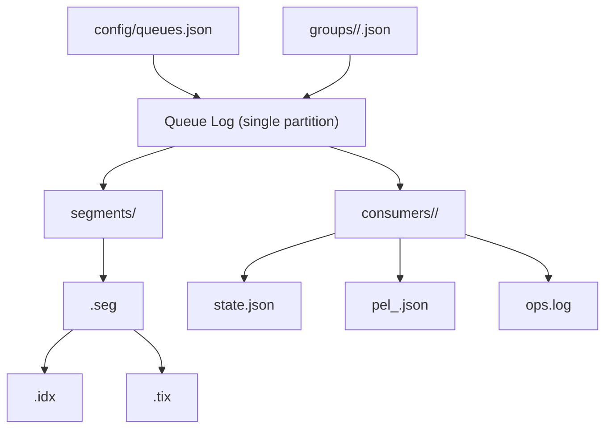

# Log Storage Internals

**Last Updated:** 2026-02-05

FluxMQ durable queues are backed by a file-based append-only log (AOL). Each queue has a **single log** (no partitions). This doc explains where the files live, how they are laid out, and how retention truncates data.

## Where It Lives

By default, the queue log storage is created under:

```
<storage.badger_dir>/queue
```

This is wired in `cmd/main.go` when the queue manager is constructed.

## Storage Roles (How It Fits In)

FluxMQ separates responsibilities across storage layers:

1. `storage/` holds broker state (sessions, subscriptions, retained messages, wills).
2. `logstorage/` holds queue logs and consumer group state.
3. Cluster metadata (etcd) tracks ownership and routing, not payloads.

If you are only dealing with durable queues, `logstorage/` is the primary place to look.

## On-Disk Layout (Directory Tree)

```
<base>/queue/
  config/
    queues.json
  groups/
    <queue-name>/
      <group-id>.json
  queues/
    <queue-name>/
      segments/
        00000000000000000000.seg
        00000000000000000000.idx
        00000000000000000000.tix
      consumers/
        <group-id>/
          state.json
          pel_0.json
          pel_1.json
          ops.log
```



## Segment Files (`.seg`)

Segment files are named by **base offset** with a 20-digit, zero-padded filename:

```
00000000000000000000.seg
```

Each segment contains a sequence of **batches**. A batch header is 44 bytes:

| Field | Size | Notes |
| --- | --- | --- |
| Magic | 4 | `FLUX` (`0x464C5558`) |
| CRC | 4 | CRC over bytes after the CRC field |
| BaseOffset | 8 | First offset in batch |
| BatchLen | 4 | Length of encoded records |
| Count | 2 | Record count |
| Flags | 2 | Compression, keys, headers, timestamps |
| Compression | 1 | none, s2, zstd |
| Version | 1 | Batch format version |
| Reserved | 2 | Reserved |
| BaseTimestamp | 8 | Unix millis |
| MaxTimestamp | 8 | Unix millis |

Records are encoded as varints:

- offset delta (from batch base)
- timestamp delta (from base timestamp)
- key (length + bytes or `-1`)
- value (length + bytes or `-1`)
- headers (count + key/value pairs)

If compression is enabled and shrinks the payload, the records section is compressed (S2 by default).

## Offset Index (`.idx`)

Each segment has a sparse offset index:

- File name: `00000000000000000000.idx`
- Header (32 bytes): magic, version, base offset, entry count, index interval
- Entries (8 bytes each): relative offset (uint32) + file position (uint32)

The index is sparse and only adds entries every N bytes written (default 4KB).

## Time Index (`.tix`)

Each segment also has a time index:

- File name: `00000000000000000000.tix`
- Header (36 bytes): magic, version, base offset, entry count, min/max timestamps
- Entries (12 bytes each): timestamp (unix ms) + relative offset

Entries are only added when timestamps advance by at least 1 second. This keeps the time index small while still making time-based lookups efficient.

## Consumer State Files

For each consumer group:

- `state.json` stores ack floor, cursor, and delivery counters.
- `pel_<n>.json` stores pending entries (sharded for parallel redelivery).
- `ops.log` is an append-only operation log used for crash recovery and fast updates.

Compaction rewrites snapshots and truncates `ops.log` after a configurable number of operations.

## Queue and Group Metadata

- `config/queues.json` stores all queue configs in one versioned file.
- `groups/<queue>/<group>.json` stores the API-level group state (cursor, consumers, PEL map). The log storage adapter syncs cursor/PEL from the low-level consumer state when you read this file through the APIs.

## Retention and Truncation

Retention is enforced by the queue manager in a background loop:

1. Compute the minimum **committed** offset across queue-mode consumer groups.
2. Compute the oldest offset allowed by retention limits (time, size, message count).
3. Truncate the log to the **lowest safe offset**.

Truncation is **segment-granular**. Entire segments whose `NextOffset <= minOffset` are deleted. Partial segments are not split.

## Walkthrough: Append and Retention

1. Producer publishes to a queue topic.
2. Queue manager calls `Append` on the log store.
3. A batch is encoded and written to the active `.seg` file.
4. Sparse `.idx` and `.tix` entries are updated.
5. A retention loop computes a safe offset and deletes old segments.

## Recovery Tools

`logstorage/recovery.go` can validate or recover segments by scanning batch headers, verifying CRCs, and rebuilding `.idx`/`.tix` files. If corruption is detected at the tail, recovery truncates to the last valid batch.
